# Cloud Based Live Video Streaming 

In short, I first created MERN application and deployed it on EC2.Then,I created three instances for video processing. 
1) Ingest Server (Works like pop server)
2) Transcoding Server (For creating multiple bitrate files of input video stream)
3) Segmentation Server (For segmentating the video streams, Streaming it through HLS to Cloudfront and storing video files in S3)

## Architecture

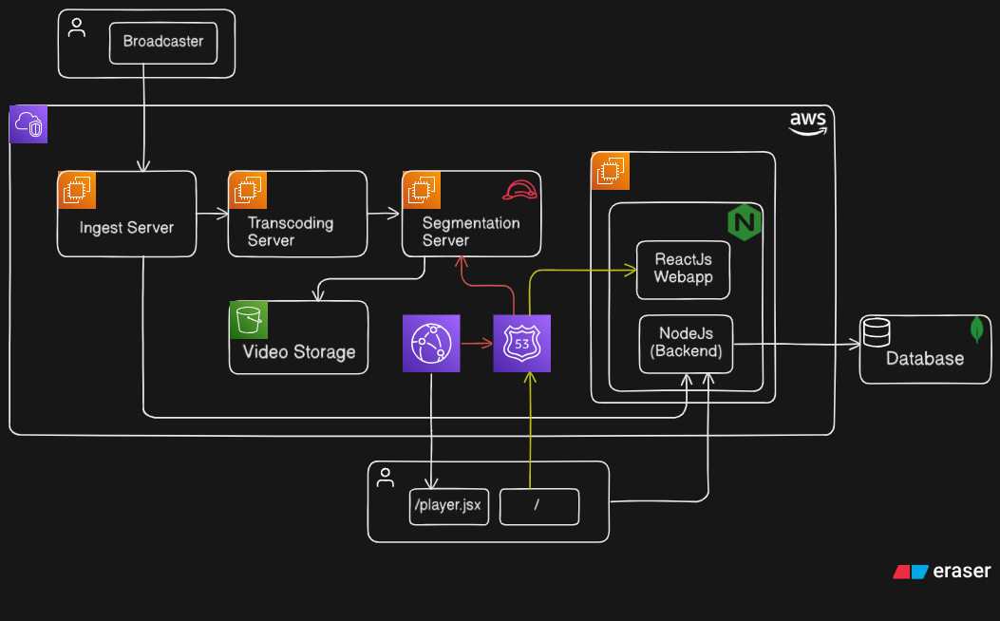

## Server Setup
ServerScripts folder contains all four server's bash script files to setup up all four servers. 

## Single Stream 

### Single video stream with latency is in between 10 to 20 sec
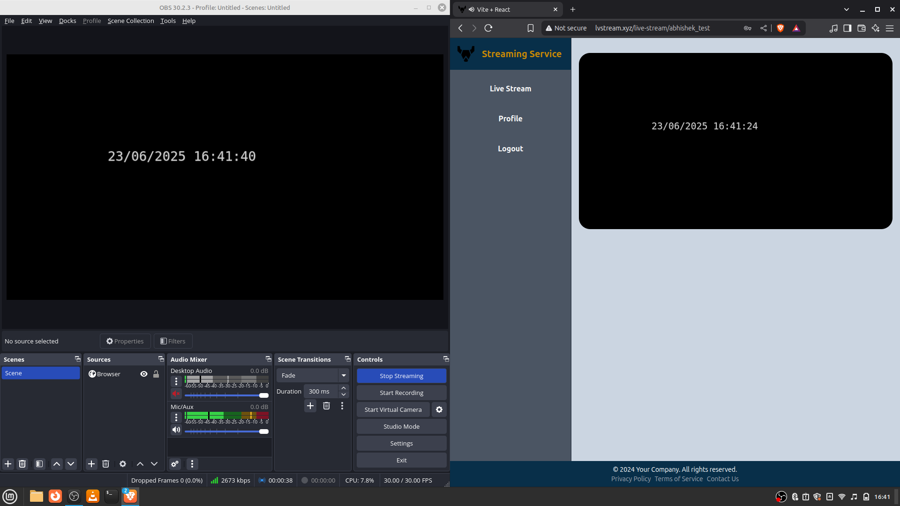

### Video streams coming from Transcoding Server
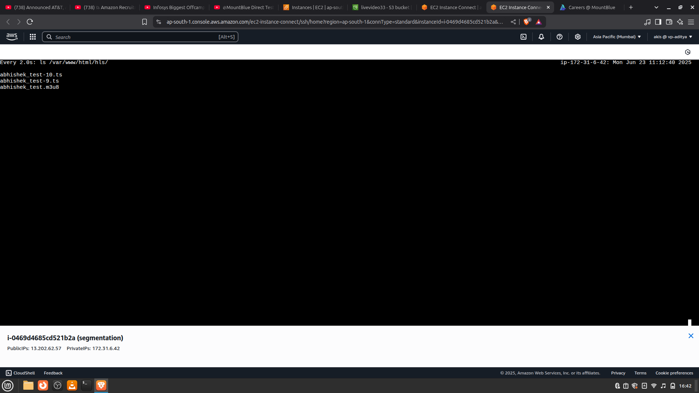

### Logs of Segmentation Server sending video(.ts) files to S3 storage.
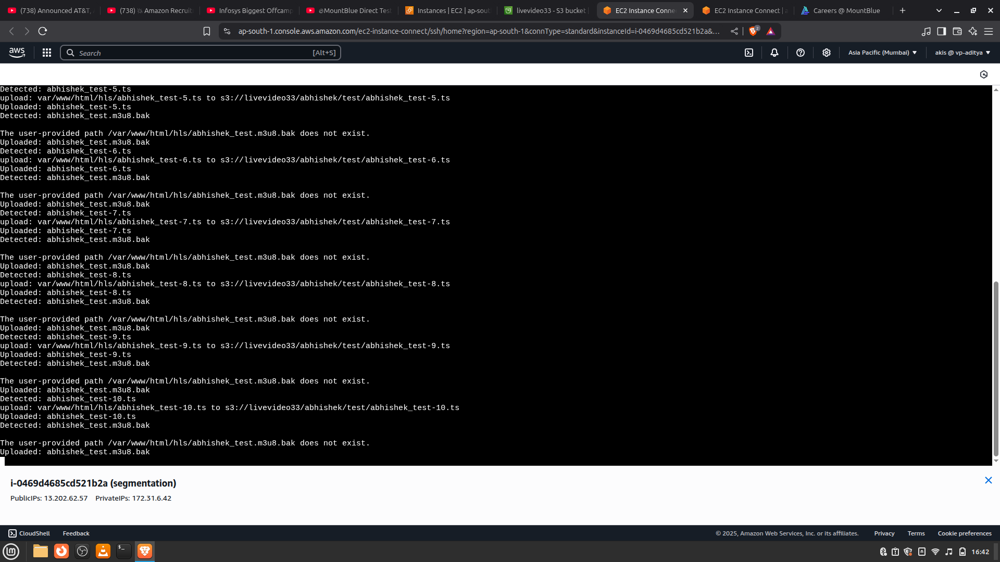

### Video stored in S3 bucket came from Segmentation Server.
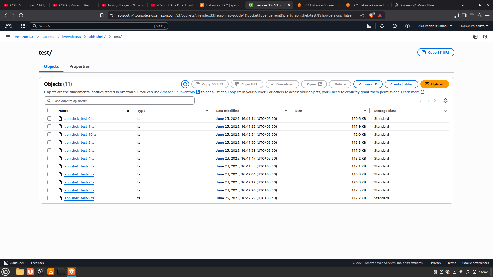

## Multiple Stream

### Multiple Video stream 
#### Frontend
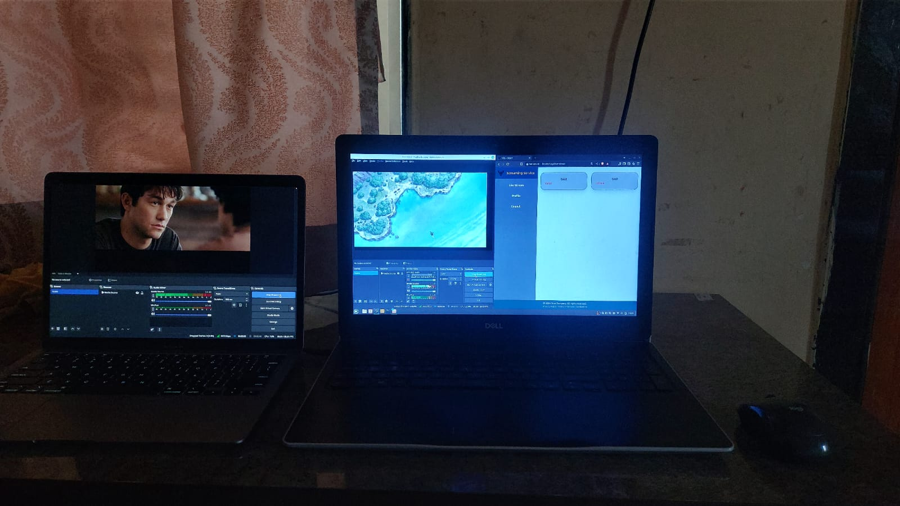
#### First Stream 
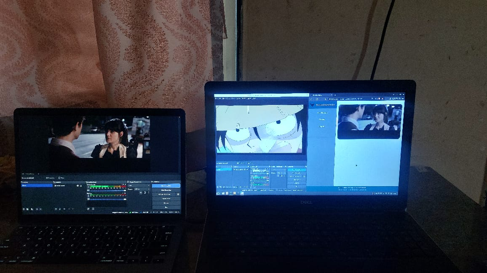
#### Second Stream
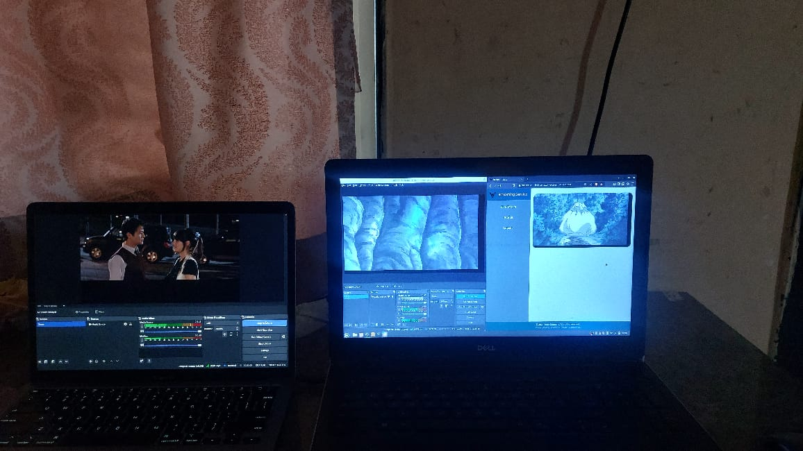

### Video streams coming from Transcoding Server
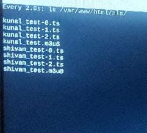

### Logs of Segmentation Server sending video(.ts) files to S3 storage.
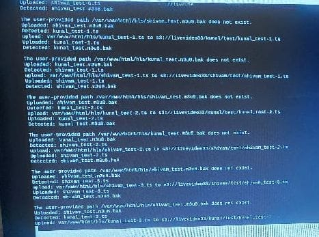

### Video stored in S3 bucket came from Segmentation Server.
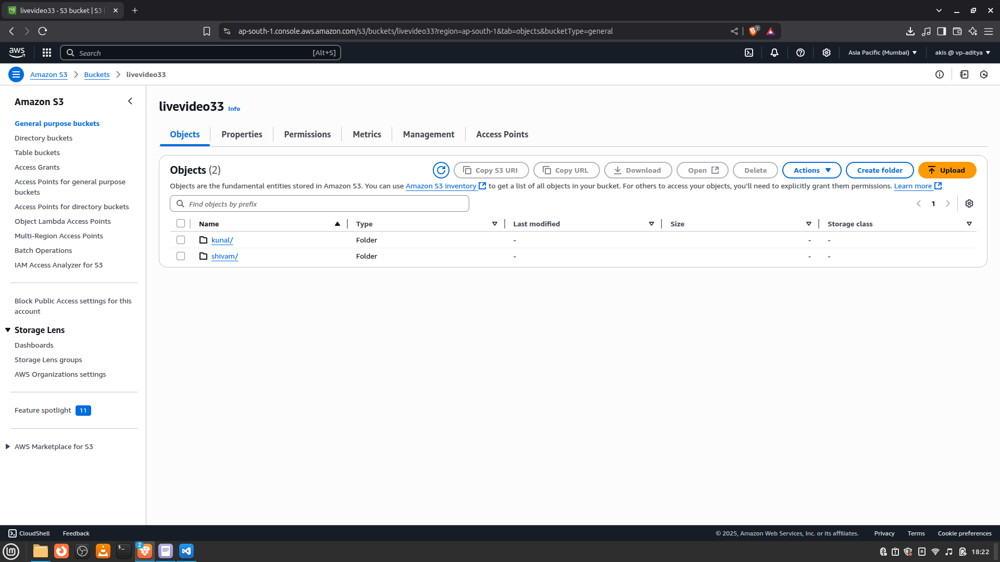